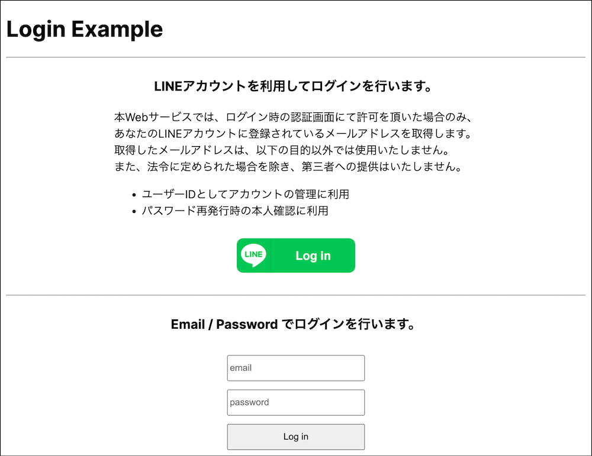

# line-login-example



## Architectures

- [Bun](https://bun.sh/)
- [Next.js v14](https://nextjs.org/)
- [NextAuth.js](https://next-auth.js.org/)
- [LINE ログイン v2.1](https://developers.line.biz/ja/docs/line-login/overview/)

## Setup

1. 以下のコマンドを実行する

   ```
   cp .env.example .env
   ```

1. `.env` を開き、`NEXTAUTH_SECRET` を設定する

1. [LINE Developers](https://developers.line.biz/console/) にログインして新規チャネル（LINE ログイン）を作成する
1. チャネル基本設定 > 基本情報 から以下の情報を `.env` に設定する

   - チャネル ID: `LINE_CLIENT_ID`
   - チャネルシークレット: `LINE_CLIENT_SECRET`

1. LINE ログイン設定 > コールバック URL に以下を設定する

   ```
   http://localhost:3000/api/auth/callback/line
   ```

1. チャネルの公開設定を「開発中」から「公開済み」へ変更する

1. 以下のコマンドを実行する

   ```
   bun i
   bun dev

   # npm の場合
   npm i
   npm run dev
   ```
